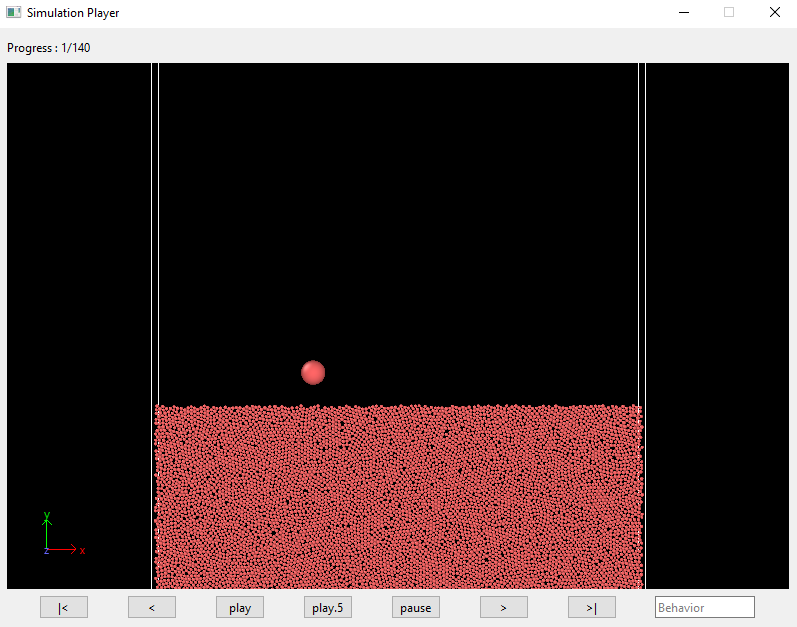
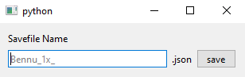

# Simulation Classification

## Setting up the environment

Clone this repository into your local machine by running the `git clone` command

        git clone https://github.com/molee1354/ovito_vis.git

Once you navigate into this new directory, you will see that there are a handful of different files of which only the following three are significant:

- `app.py` - the main application that runs
- `get_python.bat` - a batch script for installing Python (if necessary)
- `setup.bat` - a batch script setting up the correct local environment for the app to run

If all the files above are present, the app is ready to run. Start out by running the `setup.bat` script by running the following command in the command prompt:

        setup.bat

The script will first run the `py --version` command to check the Python version available on the local machine.

        Python 3.11.0
        Does the above prompt say Python 3.10.x? [y/n] : 

If you answer `y` to the prompt, the script will go ahead and create a virtual environment with whatever version of Python is currently available. It is important that the Python 3.10 interpreter is used for this app since older versions might not necessarily support the syntax, and the `ovito` module is not supported in any version newer than 3.10.

If Python doesn't exist at all (or if the `py` command doesn't work for any reason), you can simply answer `n`.

If answered `n` for the previous prompt, then you will be met with another prompt:

        Python 3.11.0
        Does the above prompt say Python 3.10.x? [y/n] : n
        Does Python 3.10 need to be installed? [y/n] : 

If you know for certain that you have Python 3.10 installed, you can answer `n`. The script will then go on to search for any available interpreters with the correct version (this will take some time), and then start setting up the virtual environment. However, if you need an installation or if you're simply unsure, answering `y` will start a start run a new installation of the correct Python version by running the `get_python.bat` command. If for some reason installation fails, then you should manually install Python from [here](https://www.python.org/ftp/python/3.10.8/). After the installation is done, you can then run the `setup.bat` script again to complete the setup.

With all the version checking and installations taken care of, if the setup script is done correctly, you should see that a few things have changed:

- There is a new `venv/` directory
- The command prompt you are working with now has a `(venv)` bit added at the beginning

This is just an indication that a new Python virtual environment with all the necessary dependencies has been activated, and that the app is now ready to be run.

## Using the app

### Starting the app and basic usage

To start the app, you can use the following command:

        app %FILEPATH%

Where `%FILEPATH%` should be the path to the directory where all the LAMMPS dump files are located. The app will read in all the files labeled `dmp.reg.*` in the `%FILEPATH%` directory and cycle through them randomly. If no `dmp.reg.*` type files are found in the `%FILEPATH%` directory, then the app will quit with the following message:

        FATAL: Could not find any files in the correct format!

But if `%FILEPATH%` gladly includes the simulation files that are to be classified, then the app will start with the following display:

Press the `play` button to play the current simulation. You can also pan and rotate the current perspective in the viewing window. 

To assign specific behaviors to the simulation displayed, you can select the `Behavior` box and type in either `FS` for *fullstop*, `RO` for *rollout*, or `RC` for *ricochet* and press enter. The input is limited to 4 characters and is not case sensitive. Inputs that are not either `FS`, `RO`, or `RC` will not be counted and pressing enter on any other input will not do anything (so as to prevent classifications input by mistake). When pressed enter with the correct input, the app will proceed to the next simulation. This new simulation will automatically play without de-selecting the behavior input box, so you can simply write in your new classification and press enter through the full list of simulations.

### Buttons

The buttons in the app window and their corresponding functions are explained below:

- `play` - plays the simulation
- `play.5` - plays the simulation in half the speed
- `pause` - pauses the simulation
- `|<` / `>|` - go to the first/last frame of the simulation
- `<` / `>` - step the simulation a single frame forward/backward (works best while paused)

## Closing the application

Note that closing the application without getting through all the listed simulation files in the `%FILEPATH%` directory **will not** save any progress.

When the last simulation is classified, the following window will pop up prompting you to save the classifications:

The filename will be automatically generated depending on how the `dmp.reg` files are named, but you can name the output file in any way you want. Omit the `.json` extension as it is redundant.

Once you pick a file name, you can either press enter or click `save` to save the classifications and quit the app. You should be able to find a new `*.json` file in your directory:

        FILENAME.json

To deactivate the virtual environment that is currently running, you can simply run the `deactivate` command in the command prompt.
